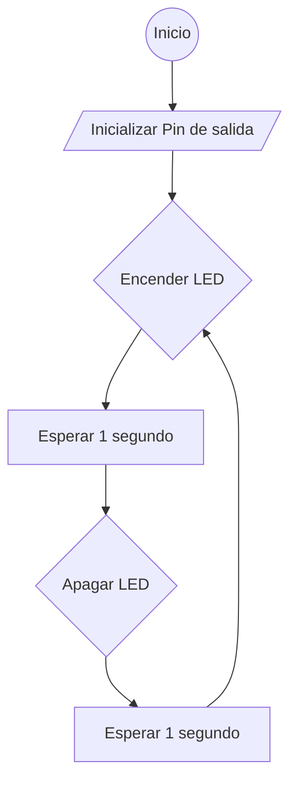
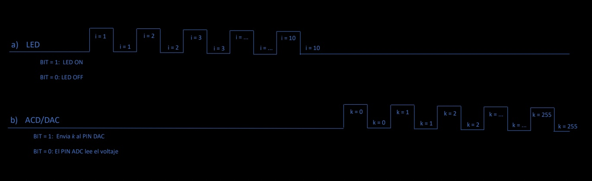

# PRACTICA 1  :  BLINK
Alumna: **Àfrica Abad**

Asignatura: Procesadores Digitales


## Objectivo
El objetivo de la práctica es producir el parpadeo periódico de un led. 
Se utilizara la salida série  para depurar  el programa 

El microcontrolador que utilizaremos es el ya comentado en la introducción  **ESP32**


## TRABAJOS I PREGUNTAS 

1. Generar el programa  y subir el codigo  al github de cada uno
```cpp
   #include <Arduino.h>
   int led = 13;

   // the setup routine runs once when you press reset:
   void setup() {                
   // initialize the digital pin as an output.
   pinMode(led, OUTPUT);     
   }

   // the loop routine runs over and over again forever:
   void loop() {
   digitalWrite(led, HIGH);   // turn the LED on (HIGH is the voltage level)
   delay(1000);               // wait for a second
   digitalWrite(led, LOW);    // turn the LED off by making the voltage LOW
   delay(2000);               // wait for a second
   }   
```

2. Modificar el programa para que incluya el envio de datos (ON y OFF) al puerto serie.
    Añadir la iunicialización del puerto serie y el envio cada vez que cambia el estado del led
   - Iniciar pin de led como salida 
   - Iniciar el terminal serie                      
   - bucle infinito  
       * encender led  
       * sacar por puerto serie mensaje *ON*          
       * espera de 1000 milisegundos  
       * apagar led  
       * sacar por puesto serie mensaje *OFF*        
       * espera de 1000 milisegundos  
   ```cpp
   #include <Arduino.h>

   int led = 13; 

   void setup() {                
      pinMode(led, OUTPUT);   
      Serial.begin(115200);
   }

   void loop() {
      Serial.println("ON");
      digitalWrite(led, HIGH);
      delay(1000);
      Serial.println("OFF");      
      digitalWrite(led, LOW);
      delay(1000);
   }
   ```

3. Modificar el programa para que actue directamente sobre los registros de los puertos de entrada y salida
   ```cpp
   #include <Arduino.h>

   int led = 13;

   void setup() {                
      pinMode(led, OUTPUT);   
      Serial.begin(115200);
   }

   void loop() {
      Serial.println("ON");
      digitalWrite(led, HIGH);
      Serial.println("OFF");      
      digitalWrite(led, LOW);
   }
   ```
4. Eliminar los delay modificar el pin de salida a uno cualquiera de los que estan disponibles i medir con el osciloscopio cual es la màxima frecuencia de apagado encendido que permite el microcontrolador. Medir la frecuencia en estos cuatro casos: 
   - 4.1 Con el envio por el puerto série del mensaje i utilizando las funciones de Arduino
   ```cpp
   #include <Arduino.h>

   int led = 13; 

   void setup() {                
      pinMode(led, OUTPUT);   
      Serial.begin(115200);
   }

   void loop() {
      Serial.println("ON");
      digitalWrite(led, HIGH);
      Serial.println("OFF");      
      digitalWrite(led, LOW);
   }
   ```
 Màxima frecuencia de apagado encendido que permite el microcontrolador en este caso: **34.2us o 29,24KHZ**

   - 4.2 Con el envio por el puerto série y accedirendo directamente a los registros:
   ```cpp
   #include <Arduino.h>

   int led = 13;
   uint32_t *gpio_out = (uint32_t *)GPIO_OUT_REG;

   void setup() {                
      pinMode(led, OUTPUT);   
      Serial.begin(115200);
   }

   void loop() {
      Serial.println("ON");
      *gpio_out |= (1 << led);
      Serial.println("OFF");      
      *gpio_out ^= (1 << led);
   }
   ```
Màxima frecuencia de apagado encendido que permite el microcontrolador en este caso: **34.2us o 29.24KHZ**

   - 4.3 Sin el envio por el puerto série del mensaje i utilizando las funciones de Arduino
```cpp
#include <Arduino.h>
int led = 13; 

void setup() {                
   pinMode(led, OUTPUT);   
}

void loop() {
   digitalWrite(led, HIGH);
   digitalWrite(led, LOW);
}
   ```
Màxima frecuencia de apagado encendido que permite el microcontrolador en este caso: **568ns o 1.76MHZ**´

   - 4.4 Sin el envio por el puerto série y accedirendo directamente a los registros
```cpp
#include <Arduino.h>

int led = 13; 
uint32_t *gpio_out = (uint32_t *)GPIO_OUT_REG;

void setup() {                
   pinMode(led, OUTPUT);   
}

void loop() {
   *gpio_out |= (1 << led);
   *gpio_out ^= (1 << led);
}
```
Màxima frecuencia de apagado encendido que permite el microcontrolador en este caso: **212ns o 4.717MHZ**

5. Generar un informe fichero  informe.MD ( markdown ) donde se muestre el codigo, un diagrama de flujo y un diagrama de tiempos 

### Diagrama de flujo



### Diagrama de tiempos



# Conclusiones
En esta primera práctica hemos tenido la primera toma de cotacto con la ESP32 y he aprendido a enlazar PlatformIO con la placa. También he aprendido a usar Markdown Preview Mermaid, una herramienta de texto que permite la representación de diagramas y gráficos.

Para hacer el código más dinámico y poner a prueva nuestros conocimientos, hemos hecho un menú de opciones dónde se pueden elegir dos opcines:
1. El modo LED 
2. El modo ADC/DAC. 

Teoria que me ha ido bien para la práctica:
- El convertidor Analógico - Digital (ADC) muestrea la señal analógica para permitir al procesador leerla en forma digital. Es un dispositivo de entrada. 
- El convertidor Digital - Analógico (DAC) es lo opuesto, produce una señal analógica en correspondencia a su forma digital. Es un dispositivo de salida.


# 
# 
# EJERCICIOS voluntarios  DE MEJORA DE NOTA


* Leer el valor de un convertidor  A/D  de entrada ; sacarlo por el puerto serie  y sacar el mismo valor  por otro pin  D/A. 


Inclusión de biblioteca y declaración de variables
```cpp
#include <Arduino.h>

int pin_DAC=25;
int pin_ADC=34;
int LED=13;
```

La función 'setup()' inicializa la comunicación serial, configura el pin del LED como salida y establece la resolución de lectura del ADC.
```cpp
void setup() {
  Serial.begin(115200); //inicialización del puerto serial. Establece la velocidad de transmisión de datos para la comunicación entre la placa Arduino y el puerto serial de la computadora.
  pinMode(LED,OUTPUT); //hemos configurado el pin del LED como una salida digital.
  analogReadResolution(12); //hemos establecido la resolución de lectura del ADC en 12 bits, lo que permite un rango de valores de 0 a 4095 para lecturas analógicas.
}
```

La función 'loop()'comprueva si hay datos disponibles en el puerto serial y, si es así, llama a la función 'menu()' para manejar las opciones del usuario.
```cpp
void loop() {
  delay(100);
  if (Serial.available()){
    menu();
  }
} 
```

La función 'led()'es la responsable de encender y apagar el LED conectado al pin 13. Cada ciclo tiene una duración de 1 segundo (0.5 segundos encendido y 0.5 segundos apagado), y muestra la información sobre el estado del LED en el puerto serial.
```cpp
void led(){
  for(int i=0;i<10;i++){ //bucle 'for' se ejecuta 10 veces, controlando el número de veces que se enciende y se apaga el LED
    digitalWrite(LED,HIGH);
    Serial.println("ON");
    delay(500);
    digitalWrite(LED,LOW);
    Serial.println("OFF");
    delay(500);
  }
}
```

La función 'adc_dac()' realiza operaciones de lectura y escritura del convertidor analógico a digital (ADC) y en el convertidor digital a analógico (DAC).
Para esta función esperabamos que los valores digitales coincidieran con los valores de la variable 'cont' (que va de 0 a 256). Sin embargo, descubrimos que los valores no coincidían por lo que podría ser un problema de resolución del ADC.

```cpp
void adc_dac(){
  int valor=0; // se declara la variable valor que se utiliza para almacenar los valores leídos del ADC y mapearlos a un rango específico
  for (int cont= 0; cont < 256; cont++){ // bucle 'for' se ejecuta 255 veces, controlando las operaciones de escritura en el DAC y de lectura en el ADC
    dacWrite(pin_DAC, cont); //escritura en el DAC (proporciona valores de voltaje entre 0 y 3.3V)
    delay(50);
    valor = analogRead(pin_ADC); //lectura del ADC
    valor = map(valor, 0, 4096, 0, 255); //mapeo del valor leído
    Serial.println("VALOR:");
    Serial.println(valor);
    delay(100);
  }
}
```
Menú
```cpp
void opcions(){
    Serial.println("Opciones");
    Serial.println("1. LED");
    Serial.println("2. ADC");
}

void menu(){
  char entrada;
  int b=0;
  if(b==0){
    opcions();
    entrada=Serial.read();
    }
  if(entrada=='1'){
    b=1;
    led();
    opcions();
    entrada=Serial.read();
  }
  else if(entrada=='2'){
    b=1;
    adc_dac();
    opcions();
    entrada=Serial.read();
  }
}
```


